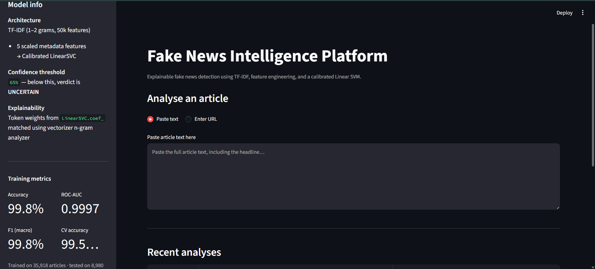
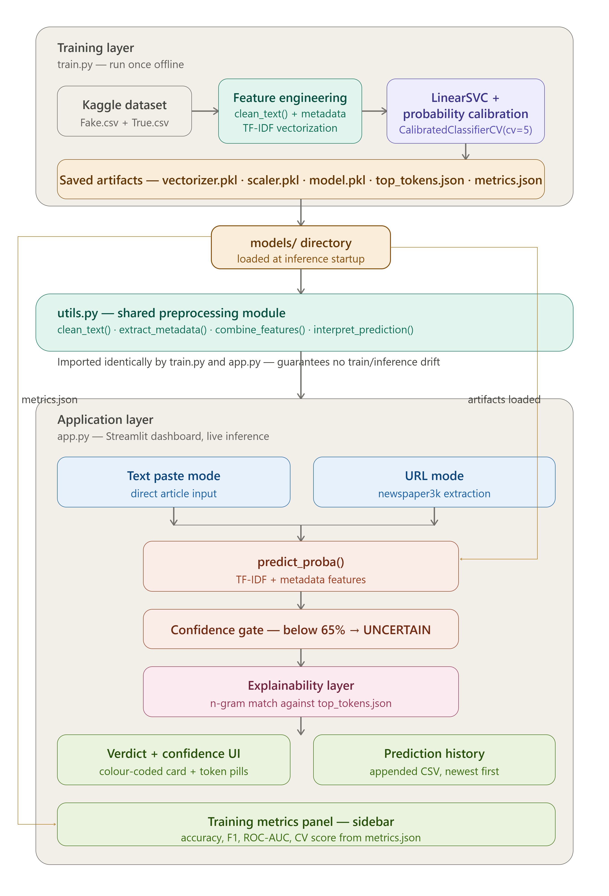
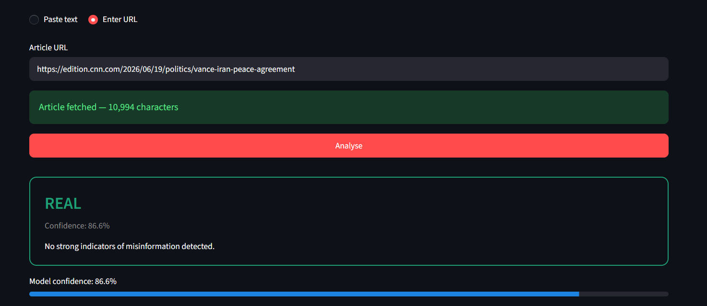
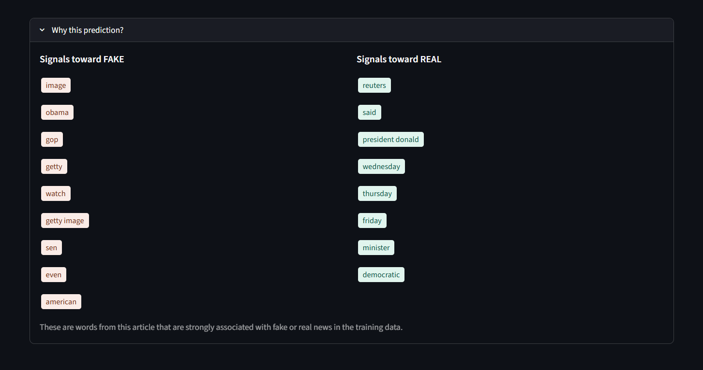

# 📰 Fake News Intelligence Platform

An explainable fake news detection system built with NLP and classical ML. Paste an article or provide a URL — the platform classifies it as **FAKE**, **REAL**, or **UNCERTAIN**, shows the confidence score, and highlights the specific tokens that drove the verdict.

Built with TF-IDF + engineered metadata features, a calibrated LinearSVC, and a Streamlit dashboard.

---

## 🎬 Demo

> Paste any news article → get a verdict, confidence score, and the words that explain the decision.



---

## 🏗️ Architecture

The system runs two separate paths that share a common preprocessing module (`utils.py`), ensuring that training and inference always apply identical text transformations. Artifacts produced by the training path (`vectorizer.pkl`, `scaler.pkl`, `model.pkl`) are loaded once at app startup and reused for every prediction.



---

## ⚙️ Features

### 🧮 Metadata feature engineering

Five hand-crafted features are computed from the raw (uncleaned) article text and combined with the TF-IDF matrix before classification. Raw text is used deliberately — punctuation and capitalisation are removed by cleaning but carry meaningful signal.

| Feature | What it captures |
|---|---|
| `text_length` | Character count |
| `word_count` | Whitespace-separated tokens |
| `avg_word_length` | Mean characters per word |
| `punct_ratio` | Punctuation chars / total chars |
| `uppercase_ratio` | Uppercase chars / total alpha chars |

Metadata is scaled with `StandardScaler` (fit on training data only) before being stacked with the sparse TF-IDF matrix.

### 🎯 Confidence-aware predictions

The model returns a probability via `CalibratedClassifierCV`. Articles below the 65% confidence threshold are returned as **UNCERTAIN** rather than forcing a hard label — a practical safeguard for ambiguous or satirical content.



### 🔍 Token-level explainability

Explainability is derived directly from `LinearSVC.coef_` — no external library required. The top-weighted tokens for each class are saved at training time. At inference, the article's n-grams (generated using the vectorizer's own analyzer, so bigrams like *"breaking news"* are handled correctly) are intersected with those weights to show which words drove the prediction.



### 🕓 Prediction history

Every analysis is appended to a local CSV with timestamp, source, verdict, and confidence. The dashboard displays recent analyses in a colour-coded table and supports clearing history with one click.

### 🔗 URL input mode

Articles can be ingested by URL using `newspaper3k`. This works for most public news sites; paywalled or JavaScript-heavy sites fall back gracefully with a clear message.

---

## 📊 Performance

Evaluated on the [Kaggle Fake and Real News Dataset](https://www.kaggle.com/datasets/clmentbisaillon/fake-and-real-news-dataset) (~45,000 articles, balanced classes).

| Metric | Score |
|---|---|
| Accuracy | 99.8% |
| F1 Score (Macro) | 99.8% |
| ROC-AUC | 0.9997 |
| Cross-Validation Accuracy | 99.5% ± 0.1% |

**A note on these numbers:** the Kaggle dataset contains strong source-level signals — for example, Reuters-specific byline patterns appear almost exclusively in real articles. The model learns these patterns and performs exceptionally on this distribution. Cross-dataset generalisation would be lower. The metrics reflect the model's performance on this benchmark; the system is designed with the explainability layer and confidence gate to surface uncertainty rather than overstate reliability.

---

## 📁 Project Structure

```
fake-news-intelligence-platform/
│
├── utils.py          ← shared preprocessing (train + inference)
├── train.py          ← training pipeline → saves artifacts
├── app.py            ← Streamlit dashboard
├── requirements.txt
│
├── assets/            ← README images
│   ├── fake_news_architecture_v2.png
│   ├── home.png
│   ├── prediction.png
│   └── explainability.png
│
├── models/           ← generated by train.py, not committed to git
│   ├── vectorizer.pkl
│   ├── scaler.pkl
│   ├── model.pkl
│   ├── top_tokens.json
│   └── metrics.json
│
└── data/             ← Kaggle CSVs, not committed to git
    ├── Fake.csv
    └── True.csv
```

The key structural decision is that `utils.py` is imported by both `train.py` and `app.py`. This makes training/inference preprocessing drift impossible — a common silent failure in deployed ML projects.

---

## 🚀 Setup

```bash
# Install dependencies
pip install -r requirements.txt

# Download NLTK data (once)
python -c "import nltk; nltk.download('stopwords'); nltk.download('wordnet')"

# Download dataset
# https://www.kaggle.com/datasets/clmentbisaillon/fake-and-real-news-dataset
# Place Fake.csv and True.csv in data/

# Train the model (~2–3 minutes on a laptop)
python train.py

# Launch the dashboard
streamlit run app.py
```

---

## 🛠️ Tech Stack

Python · Scikit-learn · NLTK · Pandas · NumPy · Streamlit · Newspaper3k · Joblib

---

## 🔮 Possible Extensions

- Evaluate on LIAR or FakeNewsNet for cross-domain generalisation metrics
- Add a user feedback button to flag incorrect predictions (future fine-tuning data)
- Benchmark a DistilBERT classifier as a second model on the same pipeline